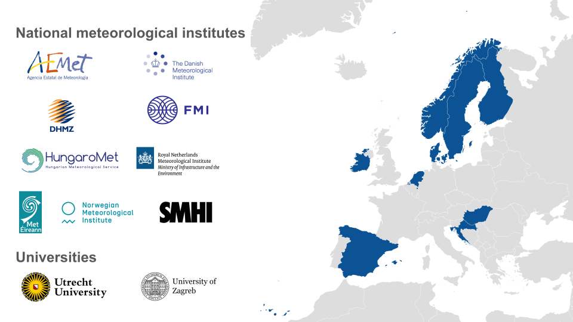

# HCLIM consortium

## List of members

HCLIM is developed by a consortium of European national meteorological institutes in close collaboration with the HIRLAM-ALADIN NWP and ACCORD model development teams.

### National meteorological institutes

- AEMET, Spain
- DMI, Denmark
- DHMZ, Croatia
- FMI, Finland
- HungaroMet, Hungary
- KNMI, the Netherlands
- Met Éireann, Ireland
- MET Norway, Norway
- SMHI, Sweden

### Universities

- Utrecht University, the Netherlands
- University of Zagreb, Croatia